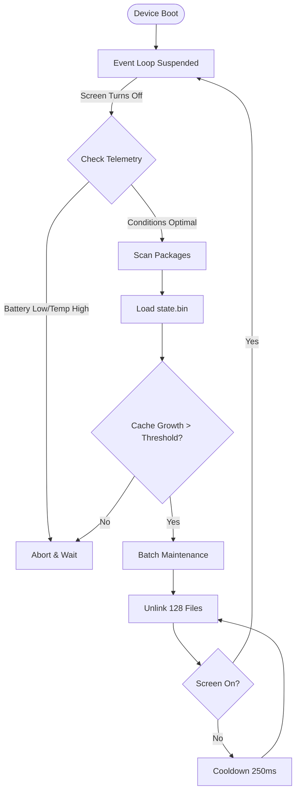

# FreshCore Native

[](https://android.com)
[](https://android.com)
[](https://kernelsu.org)

FreshCore is a native C++ Android background service designed to manage application caches. It runs as a KernelSU module.

Rather than running constantly or using aggressive memory-clearing tactics, FreshCore stays suspended using Linux `epoll` and `timerfd`. It only wakes up under specific idle conditions and cleans caches incrementally to prevent device stutter.

---

## 🧠 How It Works

FreshCore operates as a strict deterministic state machine. It guarantees zero impact on foreground tasks by completely refusing to operate while the device is in use.

### Architecture Workflow



### The Event Loop
Unlike scripts that run `while true; do sleep; done` (which forces the CPU to wake up frequently), FreshCore registers a `timerfd` with the Linux kernel's `epoll` interface. The thread is entirely put to sleep by the kernel and consumes **0% CPU** until the exact microsecond the timer expires.

### Hardware Telemetry
Before interacting with the storage disk, FreshCore polls `/sys/` nodes to ensure environmental safety:
1. **Thermal**: Reads `/sys/class/thermal/` zones. If the device is hot, maintenance is aborted to prevent thermal throttling.
2. **Battery**: Reads `/sys/class/power_supply/battery/`. Skips heavy I/O if the battery is below 25% and discharging.
3. **Memory Pressure (PSI)**: Reads `/proc/pressure/memory`. If the system is already struggling with RAM, FreshCore aborts.

---

## 🚀 Benefits

- **Zero UI Jitter**: Because maintenance is strictly tied to `Idle` screen-off states, you will never experience frame drops, animation stutters, or lag while using the phone.
- **Battery Efficiency**: The native C++ binary is compiled with `-O3` and Link-Time Optimization (LTO). Execution takes milliseconds. 
- **Safe Storage I/O**: Flash storage wears out quickly with random writes and deletions. FreshCore throttles its file deletion (`unlinkat`) into micro-batches, preventing the storage controller from queuing up massive I/O blocks.
- **Intelligent Caching**: It doesn't blindly delete everything. It keeps a binary track record (`state.bin`) of your apps. If an app hasn't accumulated new cache since the last run, FreshCore skips scanning it entirely.

---

## 📖 In-Depth Example Scenario

Imagine you finish using a heavy social media app and lock your phone. Here is exactly what FreshCore does:

1. **Locking the Screen**: Android turns off the display. FreshCore's event loop wakes up and detects the `DISPLAY_OFF` state. It sets a timer for 15 minutes.
2. **The 15-Minute Mark**: The timer fires. FreshCore checks the battery (85%, safe) and temperature (32°C, safe).
3. **Delta Scanning**: FreshCore scans `/data/data`. It compares current folder sizes against its `state.bin` record. It realizes the social media app gained 500MB of cache.
4. **Batch Deletion**: FreshCore begins deleting the 500MB cache. It deletes 128 files, then voluntarily sleeps for 250 milliseconds. This gives the Android kernel time to handle incoming notifications or background syncs without storage lockups.
5. **Sudden Wakeup**: Midway through cleaning, you receive a notification and the screen lights up.
6. **Instant Abort**: Before deleting the next batch of 128 files, FreshCore checks the screen state. Seeing the screen is ON, it instantly drops all operations and goes back to deep sleep. Your phone wakes up instantly without any lag.

---

## 📦 Installation

1. Download the `FreshCore-KSU.zip` release from the [Releases](https://github.com/kiran-embedded/FreshCoreNative/releases) page.
2. Flash it via the KernelSU Manager app.
3. Reboot your device.

## 🗑️ Uninstallation

Simply remove the module in KernelSU and reboot. The included uninstall script will automatically clean up the configuration directory, leaving no permanent traces on your device.

## 🛠️ Building from Source

You will need CMake and the Android NDK (r26b or newer).

```bash
mkdir build && cd build
cmake .. \
  -DCMAKE_TOOLCHAIN_FILE=$NDK_PATH/build/cmake/android.toolchain.cmake \
  -DANDROID_ABI=arm64-v8a \
  -DANDROID_PLATFORM=android-30 \
  -DCMAKE_BUILD_TYPE=Release
make
```
